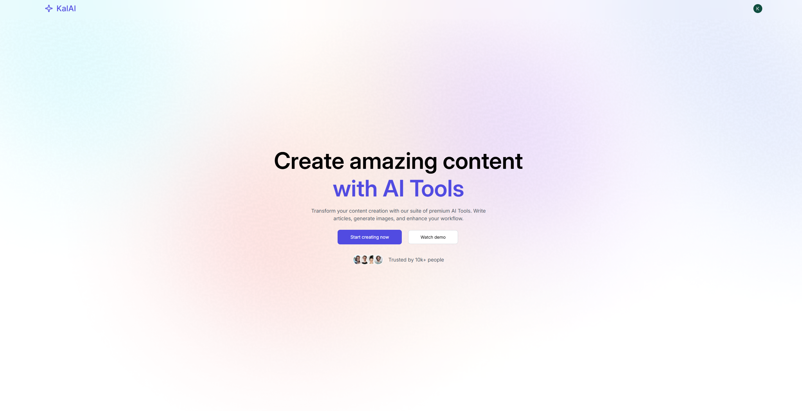

# KalAI - AI SaaS - AI-Powered Content Creation Platform

[]()

A comprehensive AI-powered SaaS platform that provides users with a suite of advanced content creation tools. Users can generate articles, blog titles, images, remove backgrounds, remove objects from images, and review resumes using cutting-edge AI technology. The platform features secure authentication, a modern React frontend, and a robust Node.js backend with AI integration.

## ✨ Features

- **AI-Powered Content Generation:** Create high-quality articles and blog titles using advanced language models.
- **Image Generation & Editing:** Generate custom images and edit existing ones with AI-powered tools.
- **Background Removal:** Automatically remove backgrounds from images with precision.
- **Object Removal:** Remove unwanted objects from images seamlessly.
- **Resume Review:** Get AI-powered feedback and suggestions for resume improvement.
- **User Authentication:** Secure login and registration with Clerk authentication.
- **Modern UI/UX:** Beautiful, responsive design built with React and Tailwind CSS.
- **File Upload:** Support for image and document uploads with Cloudinary integration.
- **Community Features:** Share and discover content with other users.
- **Dashboard:** Centralized hub for managing all AI tools and generated content.
- **Flexible Pricing Plans:** Free tier with usage limits and premium plan for unlimited access.

## 🛠️ Technologies Used

- **Frontend:**

  - React 19
  - React Router DOM
  - Tailwind CSS
  - Vite
  - React Hot Toast
  - Lucide React (icons)
  - React Markdown

- **Backend:**

  - Node.js
  - Express.js
  - Clerk Authentication
  - OpenAI API
  - Cloudinary (file uploads)
  - Multer (file handling)
  - CORS

- **Database:**

  - Neon Database (PostgreSQL)

- **Authentication:**

  - Clerk (OAuth and email/password)

- **AI Services:**

  - OpenAI GPT models
  - DALL-E for image generation
  - OpenAI Vision for image analysis

- **Deployment:**
  - Vercel (Frontend & Backend)
  - Environment variables management

## 🚀 Installation

1. **Clone the repository:**

   ```bash
   git clone https://github.com/Antoinekoe/ia-saas.git
   cd ia-saas
   ```

2. **Install frontend dependencies:**

   ```bash
   cd client
   npm install
   ```

3. **Install backend dependencies:**

   ```bash
   cd ../server
   npm install
   ```

4. **Set up environment variables:**

   **Frontend (.env in client directory):**

   ```env
   VITE_CLERK_PUBLISHABLE_KEY=your_clerk_publishable_key
   VITE_API_URL=your_backend_url
   ```

   **Backend (.env in server directory):**

   ```env
   CLERK_SECRET_KEY=your_clerk_secret_key
   OPENAI_API_KEY=your_openai_api_key
   CLOUDINARY_CLOUD_NAME=your_cloudinary_cloud_name
   CLOUDINARY_API_KEY=your_cloudinary_api_key
   CLOUDINARY_API_SECRET=your_cloudinary_api_secret
   DATABASE_URL=your_neon_database_url
   PORT=3000
   ```

5. **Configure Clerk Authentication:**

   - Go to [Clerk Dashboard](https://dashboard.clerk.com/)
   - Create a new application
   - Configure OAuth providers (Google, GitHub, etc.)
   - Get your publishable and secret keys
   - Add your domain to allowed origins

6. **Configure OpenAI API:**

   - Go to [OpenAI Platform](https://platform.openai.com/)
   - Create an account and get your API key
   - Add funds to your account for API usage

7. **Configure Cloudinary:**

   - Go to [Cloudinary](https://cloudinary.com/)
   - Create an account
   - Get your cloud name, API key, and API secret

8. **Set up Neon Database:**

   - Go to [Neon](https://neon.tech/)
   - Create a new project
   - Get your database connection string

9. **Start the development servers:**

   **Backend:**

   ```bash
   cd server
   npm run server
   ```

   **Frontend:**

   ```bash
   cd client
   npm run dev
   ```

   The frontend will be available at `http://localhost:5173` and the backend at `http://localhost:3000`.

## 📁 Project Structure

```
ia-saas/
├── client/                    # Frontend React application
│   ├── public/               # Static files
│   │   └── vite.svg          # Vite logo
│   ├── src/                  # Source code
│   │   ├── assets/           # Images and static assets
│   │   │   └── assets.js     # Asset imports
│   │   ├── components/       # Reusable React components
│   │   │   ├── AiTools.jsx   # AI tools showcase
│   │   │   ├── CreationItem.jsx # Individual tool item
│   │   │   ├── Footer.jsx    # Footer component
│   │   │   ├── Hero.jsx      # Hero section
│   │   │   ├── Navbar.jsx    # Navigation bar
│   │   │   ├── Plan.jsx      # Pricing plans
│   │   │   ├── Sidebar.jsx   # Dashboard sidebar
│   │   │   └── Testimonial.jsx # User testimonials
│   │   ├── pages/            # Page components
│   │   │   ├── BlogTitles.jsx # Blog title generation
│   │   │   ├── Community.jsx # Community page
│   │   │   ├── Dashboard.jsx # Main dashboard
│   │   │   ├── GenerateImages.jsx # Image generation
│   │   │   ├── Home.jsx      # Landing page
│   │   │   ├── Layout.jsx    # Dashboard layout
│   │   │   ├── RemoveBackground.jsx # Background removal
│   │   │   ├── RemoveObject.jsx # Object removal
│   │   │   ├── ReviewResume.jsx # Resume review
│   │   │   └── WriteArticle.jsx # Article writing
│   │   ├── App.jsx           # Main app component
│   │   ├── index.css         # Global styles
│   │   └── main.jsx          # App entry point
│   ├── index.html            # HTML template
│   ├── package.json          # Frontend dependencies
│   ├── vercel.json           # Vercel configuration
│   └── vite.config.js        # Vite configuration
├── server/                   # Backend Node.js application
│   ├── configs/              # Configuration files
│   │   ├── cloudinary.js     # Cloudinary setup
│   │   ├── db.js             # Database configuration
│   │   └── multer.js         # File upload configuration
│   ├── controllers/          # Route controllers
│   │   ├── aiController.js   # AI-related operations
│   │   └── userController.js # User management
│   ├── middlewares/          # Express middlewares
│   │   └── auth.js           # Authentication middleware
│   ├── routes/               # API routes
│   │   ├── aiRoutes.js       # AI endpoints
│   │   └── userRoutes.js     # User endpoints
│   ├── server.js             # Main server file
│   ├── package.json          # Backend dependencies
│   └── vercel.json           # Vercel configuration
├── .gitignore               # Git ignore file
└── README.md                # This file
```

## 🔐 How to Use

1. **Home Page:** Visit the landing page to learn about available AI tools and features.
2. **Authentication:** Sign up or log in using Clerk authentication (email/password or OAuth).
3. **Choose Your Plan:** Start with the free plan or upgrade to premium for unlimited access.
4. **Dashboard:** Access the main dashboard to see all available AI tools and your usage statistics.
5. **Content Generation:**
   - **Write Articles:** Generate high-quality articles on any topic
   - **Blog Titles:** Create engaging blog post titles
   - **Generate Images:** Create custom images from text descriptions
   - **Remove Background:** Automatically remove backgrounds from images
   - **Remove Objects:** Remove unwanted objects from images
   - **Review Resume:** Get AI-powered feedback on your resume
6. **Community:** Share and discover content with other users.
7. **File Management:** Upload and manage your images and documents.

## 🔒 Security Features

- **Clerk Authentication:** Secure user authentication with OAuth and email/password
- **API Key Protection:** All sensitive API keys stored in environment variables
- **File Upload Security:** Secure file uploads with validation and Cloudinary integration
- **CORS Configuration:** Proper CORS setup for secure cross-origin requests
- **Input Validation:** Server-side validation for all user inputs
- **Rate Limiting:** Protection against API abuse
- **Secure Headers:** Security headers for protection against common attacks

## 🚀 Deployment

### Frontend (Vercel)

1. Connect your GitHub repository to Vercel
2. Set the root directory to `client`
3. Configure environment variables in Vercel dashboard
4. Deploy automatically on push to main branch

### Backend (Vercel)

1. Create a separate Vercel project for the server
2. Set the root directory to `server`
3. Configure environment variables
4. The `vercel.json` file handles the serverless function configuration

## 🤝 How to Contribute

Contributions are welcome!

1. **Fork the repository.**
2. **Create a branch for your feature or fix:**
   ```bash
   git checkout -b feature/my-new-feature
   # or
   git checkout -b bugfix/bug-fix
   ```
3. **Make your changes and commit with a clear message.**
4. **Push your branch to your fork:**
   ```bash
   git push origin feature/my-new-feature
   ```
5. **Create a pull request to the `main` branch of the original repository.**

## 🔧 Potential Improvements (TODO)

- Add more AI models and providers (Anthropic, Google AI, etc.)
- Implement advanced subscription tiers (Pro, Enterprise)
- Add content templates and presets
- Create a content library for saved generations
- Implement collaborative editing features
- Add export options (PDF, Word, etc.)
- Create an API for third-party integrations
- Add analytics and usage tracking
- Implement content moderation and filtering
- Create a mobile app version
- Add real-time collaboration features
- Implement content scheduling and publishing
- Add SEO optimization tools
- Create a marketplace for AI tools and templates
- Add multi-language support
- Implement advanced image editing features
- Create a content calendar and planning tools
- Add social media integration for content sharing
- Implement usage analytics dashboard
- Add team collaboration features
- Create white-label solutions

## 🔑 License

This project is licensed under the MIT License - see the [LICENSE](LICENSE) file for details.
